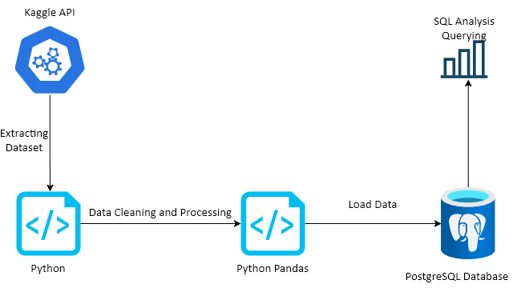

# Python-SQL-Analysis
A Python and SQL Project

# 📊 Python–SQL E-Commerce Sales Analysis

A complete end-to-end analytics project where I extracted raw data from Kaggle via the API, cleaned and transformed it using Python and Pandas, loaded it into PostgreSQL, and performed analytical SQL to uncover actionable insights on sales, profit, and product performance.

This project demonstrates my ability to work across the full data pipeline — **from ingestion → cleaning → modeling → SQL analytics → insights.**

---

## 🚀 Project Summary

This project investigates an e-commerce dataset containing customer transactions, product categories, regions, discounts, profits, and shipping details.

The goal was to uncover:

- Which products generate the most revenue  
- Regional sales performance  
- Year-over-year and month-over-month growth  
- Categories and subcategories with the highest profitability  
- Seasonal patterns in customer purchasing behavior

---

## 🛠️ Tech Stack & Tools Used

### 📥 Data Extraction
- **Kaggle API** — Used to download the dataset programmatically and ensure reproducible ingestion.

### 🐍 Data Cleaning & Transformation
- **Python**
- **Pandas**
- **Jupyter Notebook**

Cleaning steps included:
- Converting columns to proper data types  
- Handling missing values  
- Normalizing categorical fields  
- Exploring distributions and identifying inconsistencies  
- Preparing the dataset for SQL storage  

### 🗄️ Database & Analytics
- **PostgreSQL**

SQL techniques used:
- Aggregations  
- Window functions  
- CTEs  
- Year-over-year & month-over-month breakdowns  

### 📂 Version Control
- **Git & GitHub** — Used for project management and documentation.

---

## 🔍 Key Analysis Performed

### 1️⃣ Highest Revenue Generating Products  
Identified the top-performing SKUs and their contribution to total revenue.  
**Insight:** A small group of products consistently delivered the largest share of revenue.

### 2️⃣ Top Selling Products by Region  
Compared performance across major regions.  
**Insight:** Sales preferences vary significantly by region — certain subcategories are region-specific winners.

### 3️⃣ Month-over-Month Sales Comparison (2022 vs 2023)  
Tracked month-by-month revenue for two years to understand seasonality and growth.  
**Insight:** 2023 generally showed stronger monthly performance with noticeable seasonal trends.

### 4️⃣ Peak Sales Month by Category  
Determined which month each major category performed best.  
**Insight:** Each category has a unique peak-selling season, supporting marketing and inventory decisions.

### 5️⃣ Subcategory With Highest Profit Growth (2023 vs 2022)  
Measured year-over-year profit performance.  
**Insight:** Some subcategories achieved stronger profit growth despite moderate sales, showing improved margin efficiency.

---

## 📈 High-Level Findings & Business Insights

- **Technology** products consistently dominated revenue across multiple regions.  
- **Office Supplies** delivered steady sales but moderate profit due to discount effects.  
- **Seasonality** influenced buying patterns, with clear peak months.  
- **Profitability growth** varied drastically by subcategory — valuable for margin optimization.  
- **Regional behavior** highlighted opportunities for location-specific marketing strategies.

These insights can support decisions related to:
- Inventory management  
- Marketing campaigns  
- Regional segmentation  
- Product bundling and prioritization  
- Revenue and profitability forecasting  

---
